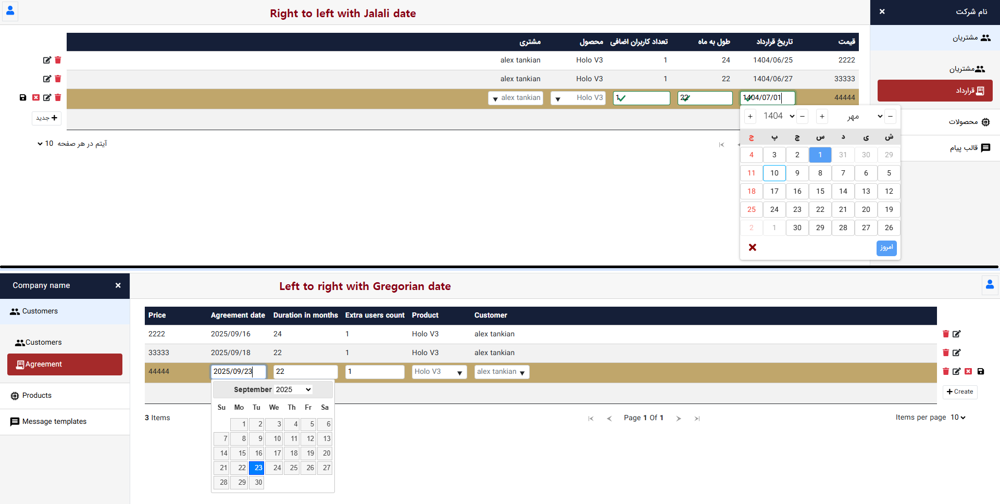

## Overview

This is a sample project created to demonstrate my programming skills and approach to software development. It highlights the use of modern frameworks, clean architecture, and design patterns to build scalable, maintainable, and extensible applications.

## Key Features & Strengths

* **Modern Frontend & Backend:**

  * Blazor frontend with a clean and responsive UI.
  * .NET Core backend demonstrating best practices in web API development.

* **Clean Architecture & Design Patterns:**

  * Layered architecture with Clean Architecture principles.
  * CQRS with Mediator, Specification, Repository, and Unit of Work patterns.
  * OOP principles applied throughout the solution.
  * Microservices structure with Identity, Contract, and Notification services.

* **Security & Real-Time Features:**

  * JWT authentication and role-based authorization.
  * Real-time notifications via SignalR.

* **Developer-Friendly Enhancements:**

  * Extended Microsoft Quick Grid for inline create/edit and backend-driven validation.
  * Class library for data import that hides Excel handling and progress reporting, allowing developers to focus purely on business logic.

* **Internationalization & Localization:**

  * Supports multiple languages and date formats via configuration.

* **Maintainable & Extensible:**

  * Focused on reusability, clear separation of concerns, and scalability for future enhancements.

## Technologies Used

* **Backend:** .NET Core, Entity Framework Core, SQL Server
* **Frontend:** Blazor, Bootstrap, jQuery
* **Architecture & Patterns:** Clean Architecture, Microservices, CQRS, Mediator, Repository, Unit of Work, Specification Pattern
* **Real-Time & Communication:** SignalR
* **Localization & Multi-Culture:** AKSoftware MultiLanguage, Culture-based date handling
* **Authentication & Security:** JWT, Role-Based Authorization

## Architecture & Design Decisions

* **Clean Architecture:**

  * UI, Application, Domain, and Infrastructure layers for maintainability and testability.

* **CQRS & Mediator:**

  * Commands and queries are separated.
  * Mediator handles requests, improving decoupling and simplifying business logic execution.

* **Repository & Unit of Work Patterns:**

  * Encapsulates data access logic and ensures transactional consistency.

* **Specification Pattern:**

  * Provides flexible and reusable query definitions.

* **Microservices Structure:**

  * Identity Service: handles authentication and user management.
  * Contract Service: manages customer agreements.
  * Notification Service: handles real-time notifications.

## Screenshots / Visuals

* **Data grid validation with DTO validation attributes:**
  

* **Multi-Language Support:**
  

* **Import data and notify progress:**
  

